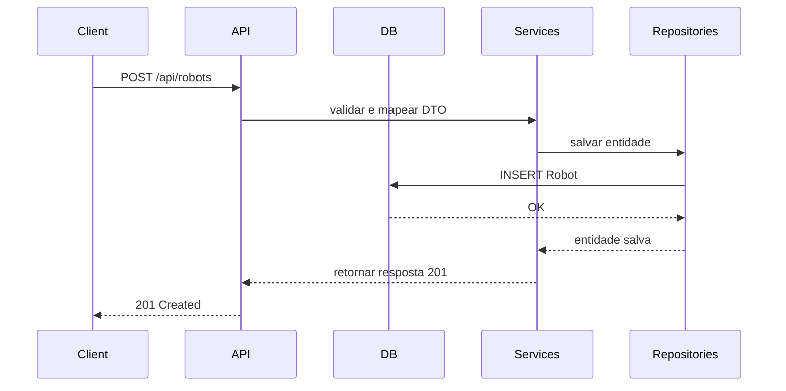

**Mega Man Robots API**

Este repositório contém a **Mega Man Robots API**, um serviço RESTful desenvolvido em .NET Core que disponibiliza informações sobre robôs do universo Mega Man. A documentação foi criada e estruturada utilizando ferramentas de IA (ChatGPT e GitHub Copilot) para ilustrar como elas podem agilizar a produção de documentações técnicas claras e organizadas.

---

## Índice

1. [Visão Geral](#visão-geral)
2. [Funcionalidades](#funcionalidades)
3. [Pré-requisitos](#pré-requisitos)
4. [Instalação e Execução](#instalação-e-execução)
5. [Arquitetura do Projeto](#arquitetura-do-projeto)
6. [Endpoints da API](#endpoints-da-api)
7. [Exemplos de Uso](#exemplos-de-uso)
8. [Diagrama de Fluxo](#diagrama-de-fluxo)
9. [Como Contribuir](#como-contribuir)
10. [Licença](#licença)

---

## Visão Geral

A Mega Man Robots API expõe rotas para listar, buscar, criar, atualizar e remover robôs. Cada robô contém atributos como nome, modelo, elemento e habilidades especiais.

> **Objetivo da IA**: Utilizamos **ChatGPT** para gerar descrições claras de cada seção e **GitHub Copilot** para sugerir exemplos de código e trechos de configuração.

---

## Funcionalidades

* **GET** `/api/robots`: lista todos os robôs cadastrados.
* **GET** `/api/robots/{id}`: obtém detalhes de um robô específico.
* **POST** `/api/robots`: adiciona um novo robô.
* **PUT** `/api/robots/{id}`: atualiza dados de um robô.
* **DELETE** `/api/robots/{id}`: remove um robô.

---

## Pré-requisitos

* [.NET Core SDK 7.0+](https://dotnet.microsoft.com/download)
* [SQL Server Express](https://www.microsoft.com/pt-br/sql-server/sql-server-downloads)
* [Postman](https://www.postman.com/) ou similar para testes de API

---

## Instalação e Execução

```bash
# Clone o repositório
git clone https://github.com/seu-usuario/MegaApiDotnetCore.git
cd MegaApiDotnetCore

# Configure string de conexão no appsettings.json
# Exemplo:
# "ConnectionStrings": { "DefaultConnection": "Server=.\\SQLEXPRESS;Database=MegaApi;Trusted_Connection=True;" }

# Restaure dependências e execute
dotnet restore
dotnet run
```

A API estará disponível em `https://localhost:5001`.

---

## Arquitetura do Projeto

* **Controllers**: definem rotas e orquestram chamadas a serviços.
* **Services**: implementam lógica de negócio.
* **Repositories**: realizam operações de acesso a dados via Entity Framework Core.
* **Models**: classes de entidade e DTOs.

> **Geração de Diagrama**: Utilizamos o plugin **PlantUML** integrado ao VSCode com o **Copilot** sugerindo a sintaxe UML.

---

## Endpoints da API

| Método | Rota               | Descrição                          |
| ------ | ------------------ | ---------------------------------- |
| GET    | `/api/robots`      | Retorna todos os robôs             |
| GET    | `/api/robots/{id}` | Retorna um robô pelo identificador |
| POST   | `/api/robots`      | Cria um novo robô                  |
| PUT    | `/api/robots/{id}` | Atualiza um robô existente         |
| DELETE | `/api/robots/{id}` | Deleta um robô                     |

---

## Exemplos de Uso

### Listar Robôs

```bash
curl -X GET https://localhost:5001/api/robots
```

**Resposta**:

```json
[
  { "id": 1, "name": "Cut Man", "model": "CM-01", "element": "Energia Cortante" },
  { "id": 2, "name": "Guts Man", "model": "GM-02", "element": "Super Força" }
]
```

### Criar Robô

```bash
curl -X POST https://localhost:5001/api/robots \
  -H "Content-Type: application/json" \
  -d '{ "name": "Elec Man", "model": "EM-03", "element": "Eletricidade" }'
```

---

## Diagrama de Fluxo



> **Nota**: o código acima foi gerado com auxílio do **Copilot** e ajustado via **ChatGPT**.

---

## Como Contribuir

1. Fork deste repositório.
2. Crie uma branch (`feature/nova-funcionalidade`).
3. Faça commit das alterações.
4. Envie um Pull Request.

> **Dica de IA**: use o **Copilot** para sugerir mensagens de commit claras e descritivas.

---

## Licença

Este projeto está licenciado sob a **MIT License**. Consulte o arquivo [LICENSE](LICENSE) para detalhes.
